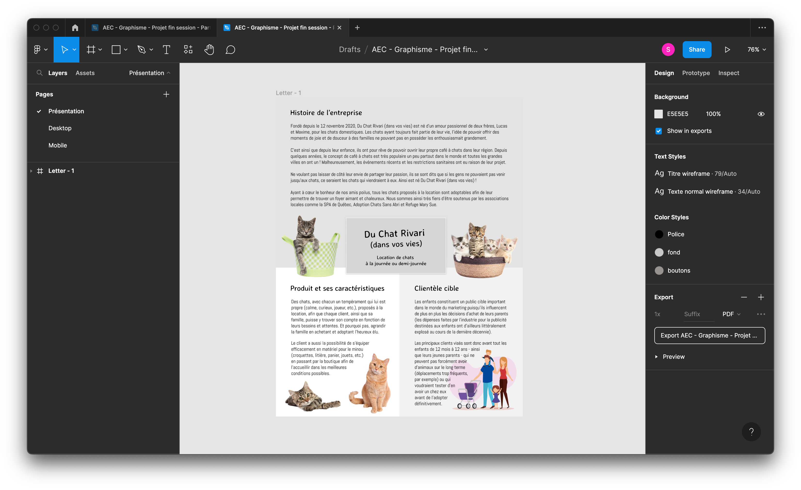
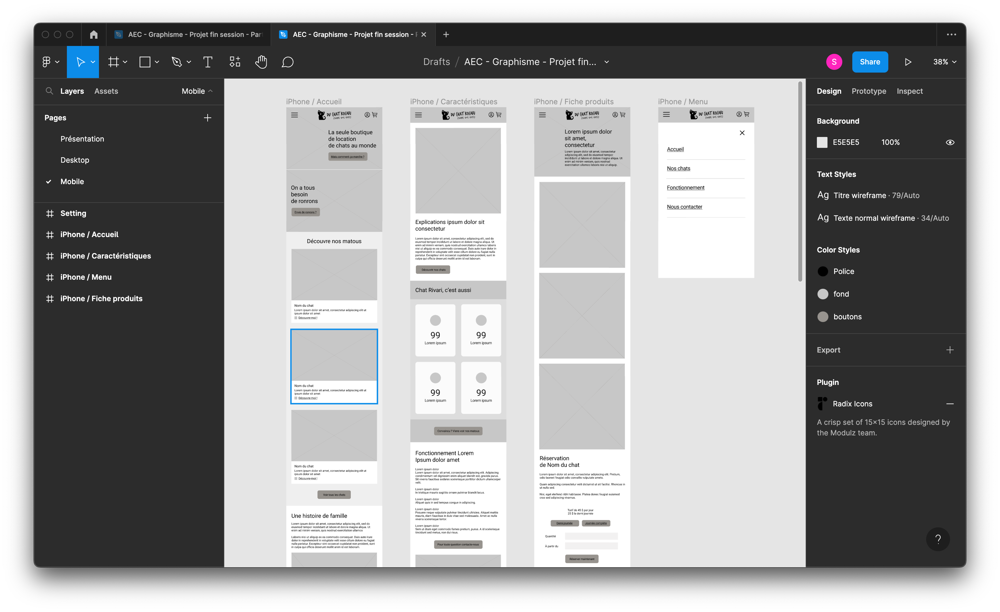
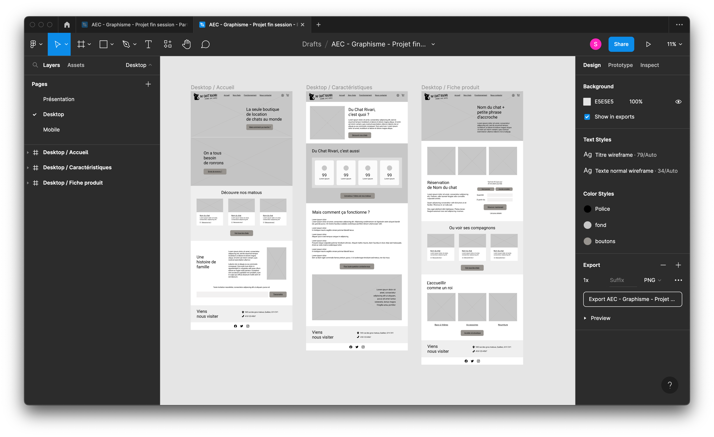
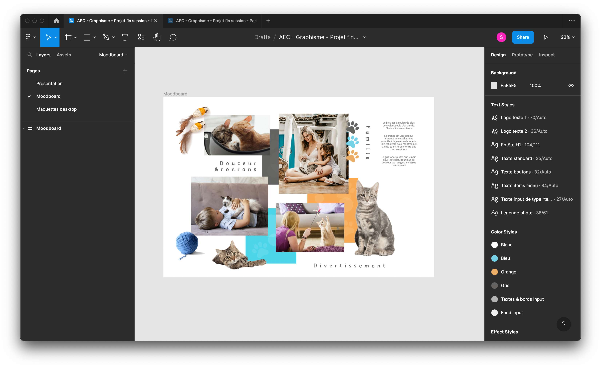
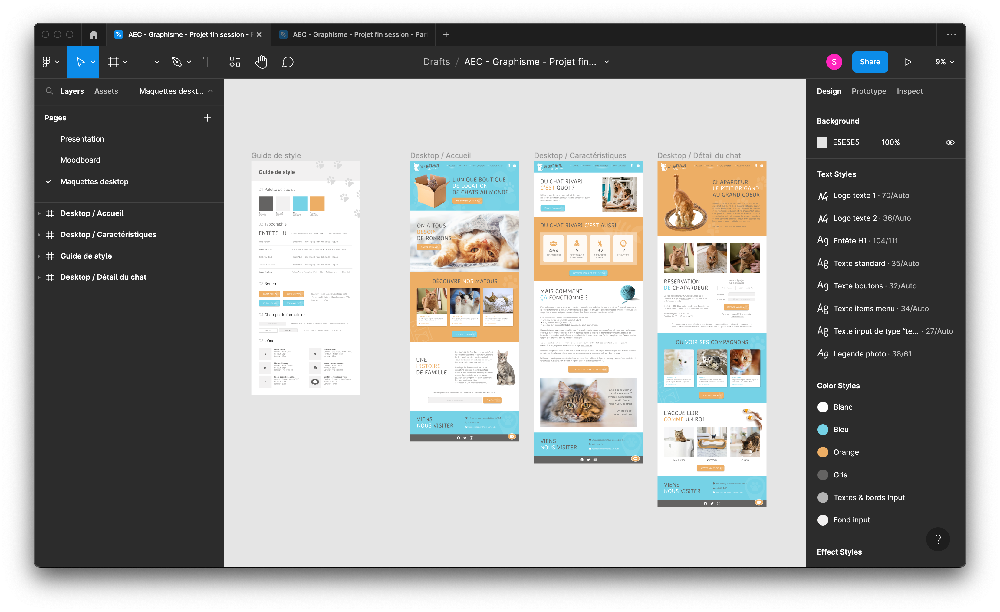

# Description 

Projet réalisé dans le cadre de mon AEC en développement web. 

Il s'agissait de réaliser pour un client fictif un site web transactionnel responsive pour faire la promotion de son nouveau produit.  

Les grandes étapes du travail à réaliser étaient : 
1. Choix du sujet, description du produit, de la clientèle cible 
2. Maquettes filaires (wireframe) : page d’accueil, page caractéristiques et page fiche de produit (format mobile et desktop)
3. Direction artistique (moodboard)
4. Maquettes graphiques et UI Kit : page d’accueil, page caractéristiques et page fiche de produit (format mobile et desktop)
5. Prototype fonctionnel
6. Présentation orale

## Table des matières

1. [Visuels](#visuels)
    - [Présentation du projet](#présentation-du-projet)
    - [Maquettes filaires version mobile](#maquettes-filaires-version-mobile)
    - [Maquettes filaires version desktop](#maquettes-filaires-version-desktop)
    - [Moodboard](#moodboard)
    - [Maquettes graphiques](#maquettes)
2. [Prototypes Figma](#prototypes-figma)

# Visuels 

## Présentation du projet

## Maquettes filaires version mobile

## Maquettes filaires version desktop

## Moodboard

## Maquettes graphiques

# Prototypes Figma 

[Prototype Figma des maquettes filaires mobiles](https://www.figma.com/proto/FbDnU6kOYcdhLsW036k7Iz/AEC---Graphisme---Projet-fin-session---Partie-1?page-id=84%3A263&node-id=84%3A350&viewport=527%2C443%2C0.09&scaling=min-zoom)

[Prototype Figma des maquettes filaires desktop](https://www.figma.com/proto/FbDnU6kOYcdhLsW036k7Iz/AEC---Graphisme---Projet-fin-session---Partie-1?page-id=0%3A1&node-id=4%3A288&viewport=-29%2C212%2C0.09&scaling=min-zoom)

[Prototype du moodboard](https://www.figma.com/proto/NPhW90xLWC1jj43FQIPUKf/AEC---Graphisme---Projet-fin-session---Partie-2?page-id=806%3A44&node-id=806%3A45&viewport=437%2C368%2C0.28&scaling=min-zoom)

[Prototype des maquettes graphiques](https://www.figma.com/proto/NPhW90xLWC1jj43FQIPUKf/AEC---Graphisme---Projet-fin-session---Partie-2?page-id=806%3A47&node-id=806%3A592&viewport=564%2C368%2C0.09&scaling=min-zoom)

 
